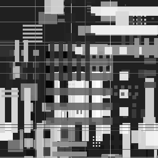
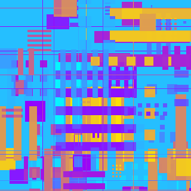
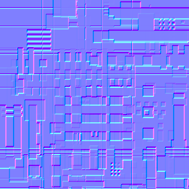
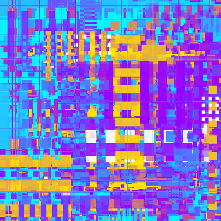

# cppdisplacementx

[](https://github.com/laiambryant/laiambryant-cppdisplacementx/actions/workflows/ci.yml)
[](https://en.cppreference.com/w/cpp/17)

[](LICENSE)

Embeddable C++17 core of the Displacement X / JSplacement height-field
generator. It is the in-process sibling of
[godisplacementx](https://github.com/laiambryant/godisplacementx) (Go, CPU) and
[gpudisplacementx](https://github.com/laiambryant/gpudisplacementx) (Rust, wgpu):
same generator, linked directly into a host binary, no subprocess and no CLI.

## Samples

| | |
|---|---|
|  |  |
| Grayscale height field | Colour gradient (`OutputMode::COLOR`) |
|  |  |
| Normal map (`OutputMode::NORMAL`) | Dense layering, all 16 composition modes |

All four are seeded, reproducible CPU renders at 320x320.

## Features

- Zero dependencies — the host decodes sprite PNGs, owns the GPU device, and
  writes files; the library never touches the filesystem.
- Deterministic: one seed produces one output, bit-identical across the CPU
  and GPU backends.
- Multithreaded CPU compositor with exact (non-approximate) SSE2 fast paths.
- A ready-to-hand-off Vulkan GLSL compute shader for GPU compositing.
- Grayscale, normal-map, and colour-gradient post-processing.

## Layout

| Header | Responsibility |
|---|---|
| `rng.h` | The frozen PCG32 (XSH-RR 64/32) stream |
| `params.h` | Generator settings, composition-mode and sprite-pack tables |
| `command_list.h` | Draw-command generation — the only place randomness lives |
| `tile_bins.h` | 32x32 tile binning for the tiled compositor |
| `blend.h` | Integer-only blend math, mirror of the compute shader |
| `simd_row_blend.h` | SSE2 fast paths, exact rather than approximate |
| `cpu_compositor.h` | Ordered CPU backend |
| `composite_glsl.h` | Vulkan GLSL compute source for a GPU backend |
| `post.h` | Invert, gradient colouring, normal map |
| `sprite_atlas.h` | Flat atlas the host fills with decoded sprites |

## Determinism

One seed produces one output on every backend and every machine:

1. All randomness is generated in `command_list.cpp`; shaders and compositors
   replay a flat, data-only command list and consume no RNG.
2. The RNG stream in `rng.cpp` is byte-identical to gpudisplacementx's and
   frozen — changing a constant changes every seeded output ever made.
3. Every blend is integer-only. `blend.h` and `composite_glsl.cpp` are
   line-for-line counterparts, and the SIMD paths in `simd_row_blend.h` are
   cross-checked against the scalar path for every supported mode.

`tests/parity_tests.cpp` covers all three.

## Building

The library is normally compiled straight into the host's build (nine `.cpp`
files, no configuration). For standalone work:

```sh
cmake -B build -S .
cmake --build build
ctest --test-dir build
```

## Licence

GPL-3.0, matching its sibling repositories.

## Credits

Part of the Displacement X family, a C++/Go/Rust reimplementation of
[satelllte/displacementx](https://github.com/satelllte/displacementx).
